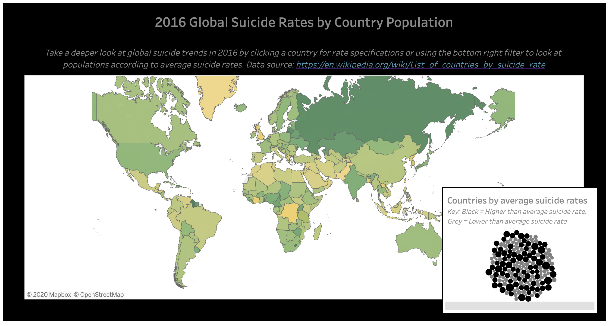

Predicting Global Suicide Rates With Social Determinants
================

### Project Overview

-----

Suicide is the 10th leading cause of death worldwide. With diverse
biological and social determinants, suicidal behavior and ideation
present a complex, global risk to public health across all age groups.

This project stems off a personal interest in mental disorder’s role in
public health, webscraping, and statistical modeling. The 2016
international suicide prevalence is examined through lenses of 2015
mental disorder rates, unemployment, literacy, healthcare expenditure
and gender ratios. Social factors potentially driving whether a country
had suicide rates above or below the worldwide average are identified.

### Project Sources

-----

**Suicide Rates**- 2016 Suicide rate as per data published by the World
Health Organization (WHO) and other sources. Webscraped from Wikipedia’s
‘List of countries by suicide rate’ page found
[HERE](https://en.wikipedia.org/wiki/List_of_countries_by_suicide_rate)

**Literacy Rates**- 2015 Adult literacy rate of UN member, observer
states & additional territories by population percentage. Webscraped
from Wikipedia’s ‘List of countries by literacy rate’ page found
[HERE](https://en.wikipedia.org/wiki/List_of_countries_by_literacy_rate)

**Mental & Substance Abuse Disorder Prevalence**- 2015 Prevalence of
mental and substance use disorders by percent of population. CSV sourced
from [ourworldindata.org](https://ourworldindata.org/mental-health)

**Unemployement Rates**- 2015 rates of unemployement per country of
those currently available and seeking work. CSV sourced from
[ourworldindata.org](https://ourworldindata.org/grapher/unemployment-rate?time=2015)

**Healthcare Expenditure**- 2015 total health expenditure per capita in
U.S. dollars. Not inflation adjusted. Webscraped from Wikipedia’s ‘List
of countries by total health expenditure per capita’ page found
[HERE](https://en.wikipedia.org/wiki/List_of_countries_by_total_health_expenditure_per_capita)

**Gender Ratio**- 2015 distribution of male and female identifying
individuals across the globe. CSV sourced from
[ourworldindata.org](https://ourworldindata.org/gender-ratio)

### Project Files

-----

#### General files

  - *README.ipynb*- Current file. Project overview.

  - *project\_data\_dictionary.ipynb*- Description of project variable
    names

#### data/ folder

  - *raw\_data/* - Includes all raw csv files as identified in project
    sources section

  - *processed\_data/* - Includes cleaned csv file of merged scraped and
    downloaded data sources used in modeling analyses

#### code/ folder

**exploration/ subfolder** \* Files are numbered in chronological order

  - *01\_data\_exploration.ipynb*: Markdown file of exploratory data
    analysis (EDA) results

  - *02\_model\_results.ipynb*: Markdown file of model results and their
    interpretation

**script/ subfolder** \* *01\_do\_webscraping.py*- Code used to scrape
and clean data from Wikipedia sources into a single, clean pandas data
frame (see above project sources for Wikipedia page details)

  - *02\_do\_data\_cleaning.py*- Code used to merge and clean scraped
    dataset and those pulled from alternative sources (see above section
    for details all project sources)

  - *03\_do\_modeling.py*- Code with machine learning algorithms used to
    predict whether a country was above or below the average suicide
    rate in 2016. Models used in analyses include naive bayes, KNN
    classification and logistic regression. Final model ensemble method.
    See section below for results overview

  - *functions/ subfolder*- Includes functions utilized for data
    scraping (funs\_do\_webscraping.py) and modeling
    (funs\_model\_data.ipynb)

### Project Results

-----

Countries were classified as either above or below the average global
rate of suicide. Mental health disorder prevalence, healthcare
expenditure, gender ratio and unemployment rates by country were
included as predictive variables. An ensemble learning voting classifier
utilizing k-NN classification, logistic regression and a decision tree
as base algorithms produced the highest model accuracy, predicting
countries’ as above or below the average global rate of suicide at 76%
accuracy.

Findings suggest that the included social determinants can be utilized
in preemptive identification of populations at risk of suicidal action
the following year. Caveats of small sample size and diverse data
collection sources are acknowledged. All relationships highlighted in
current project are utilized for demonstrative purpose only.

For additional project results, refer to the markdown file
*02\_model\_results.ipynb*. For additional project vizualization, visit
the project Tableau dashboard via Tableau Public
[HERE](https://public.tableau.com/views/2016GlobalSuicideTrends/Story1?:language=en&:display_count=y&publish=yes&:origin=viz_share_link)

### Project References

-----

  - Ferretti, F., & Coluccia, A. (2009). Socio-economic factors and
    suicide rates in European Union countries. Legal Medicine, 11,
    S92–S94. <https://doi.org/10.1016/j.legalmed.2009.01.014>
  - Milner, A., Page, A., & LaMontagne, A. D. (2013). Long-Term
    Unemployment and Suicide: A Systematic Review and Meta-Analysis.
    PLoS ONE, 8(1), e51333.
    <https://doi.org/10.1371/journal.pone.0051333>
  - Too, L. S., Spittal, M. J., Bugeja, L., Reifels, L., Butterworth,
    P., & Pirkis, J. (2019). The association between mental disorders
    and suicide: A systematic review and meta-analysis of record linkage
    studies. Journal of Affective Disorders, 259, 302–313.
    <https://doi.org/10.1016/j.jad.2019.08.054>
  - Freeman, A., Mergl, R., Kohls, E., Székely, A., Gusmao, R.,
    Arensman, E., Koburger, N., Hegerl, U., & Rummel-Kluge, C. (2017). A
    cross-national study on gender differences in suicide intent. BMC
    Psychiatry, 17(1). <https://doi.org/10.1186/s12888-017-1398-8>
  - Batterham, P. J., Calear, A. L., & Christensen, H. (2013).
    Correlates of Suicide Stigma and Suicide Literacy in the Community.
    Suicide and Life-Threatening Behavior, 43(4), 406–417.
    <https://doi.org/10.1111/sltb.12026>
